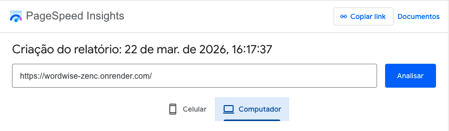
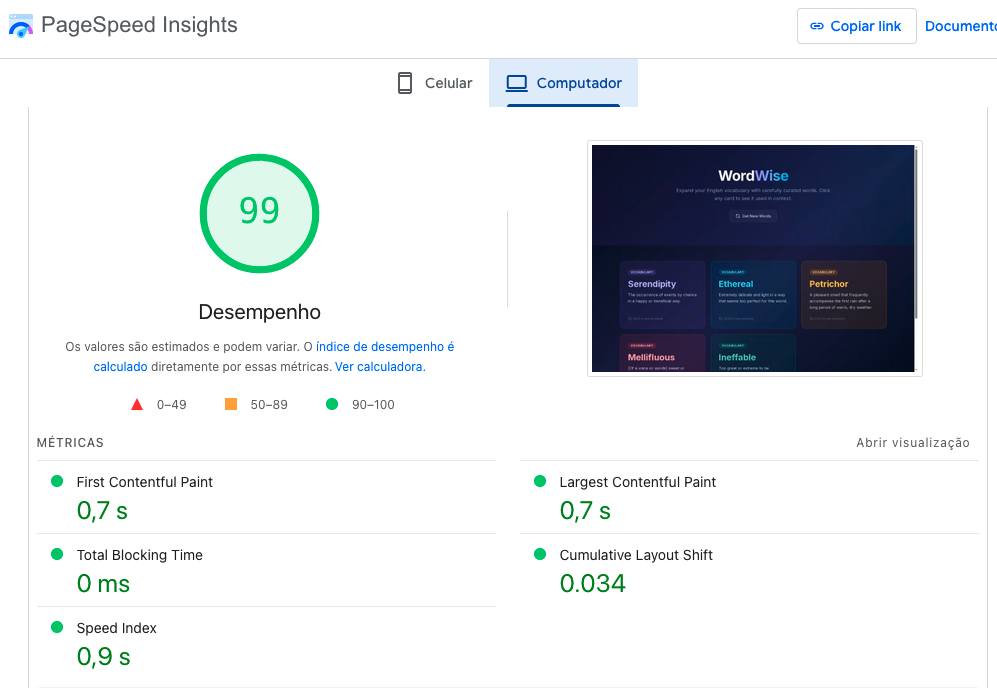
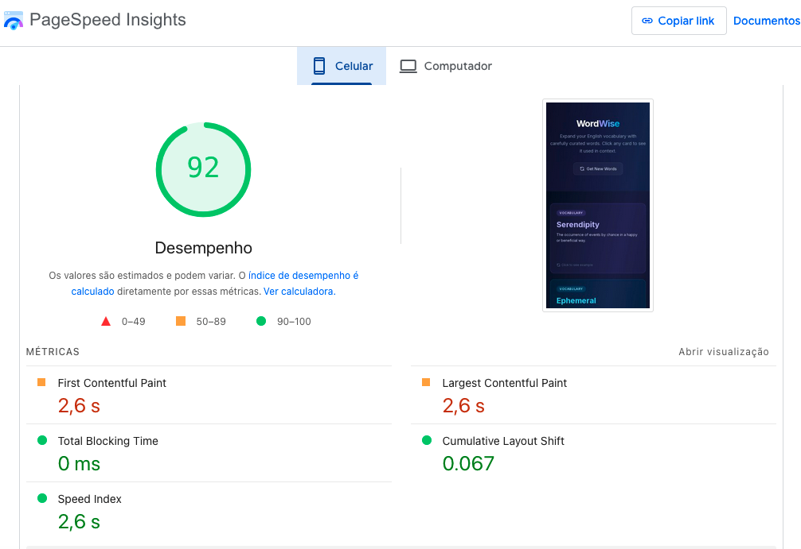

# WordWise - English Vocabulary Builder

WordWise is a web application designed to help users expand their English vocabulary. It consumes a BFF (Backend for Frontend) API powered by OpenAI that returns curated English words along with their definitions and real-world usage examples.

Built as part of the **FIAP Front-end Engineering** course.

## Preview

The application displays vocabulary words as interactive flip cards — click any card to reveal an example sentence showing the word used in context. Each session fetches a fresh set of words from the AI-powered BFF.

## Tech Stack

| Technology | Purpose |
|---|---|
| [React](https://react.dev/) | UI library |
| [TypeScript](https://www.typescriptlang.org/) | Type safety |
| [Tailwind CSS v4](https://tailwindcss.com/) | Utility-first styling |
| [Vite](https://vite.dev/) | Build tool & dev server |

## Features

- Fetches vocabulary words from the BFF API
- Interactive flip cards with definitions on the front and usage examples on the back
- Color-coded cards for visual distinction
- "Get New Words" button to refresh the word list
- Loading skeleton while data is being fetched
- Error handling with retry functionality
- Fully responsive design (mobile, tablet, desktop)
- Dark theme with glassmorphism-style UI

## Getting Started

### Prerequisites

- [Node.js](https://nodejs.org/) (v18 or higher)
- npm (comes with Node.js)

### Installation

```bash
# Clone the repository
git clone https://github.com/PauloCesar1218/WordWise.git

# Navigate to the project directory
cd WordWise

# Install dependencies
npm install
```

### Running Locally

```bash
npm run dev
```

The app will be available at `http://localhost:5173/`.

### Building for Production

```bash
npm run build
```

The optimized output will be generated in the `dist/` folder.

### Previewing the Production Build

```bash
npm run preview
```

## BFF (Backend for Frontend)

The application consumes a Node.js BFF that integrates with OpenAI to generate vocabulary words.

- **BFF Repository**: https://github.com/PauloCesar1218/nodejs-fiap-bff
- **BFF Public URL**: https://nodejs-fiap-bff-projectname.onrender.com/ask

The API returns an array of objects with the following structure:

```json
{
  "word": "English word",
  "description": "Explanation of the word",
  "useCase": "A sentence using the word in context"
}
```

## Deployment

### Render

This project is currently deployed on [Render](https://render.com) as a **Static Site**.

Deployment Steps Applied:
1. Connected GitHub repository
2. Set the build command to `npm run build`
3. Set the publish directory to `dist`

The application is updated automatically when new commits are pushed to the main branch

Public URL:

- https://wordwise-zenc.onrender.com/

## Project Structure

```
src/
├── components/
│   ├── WordCard.tsx        # Interactive flip card component
│   ├── LoadingSkeleton.tsx # Loading state placeholder
│   └── ErrorState.tsx      # Error state with retry
├── hooks/
│   └── useWords.ts         # Custom hook for API fetching
├── types.ts                # TypeScript interfaces
├── App.tsx                 # Main application component
├── main.tsx                # Entry point
└── index.css               # Tailwind CSS imports & base styles
```

## License

This project was developed for educational purposes as part of the FIAP Front-end Engineering curriculum.

## Métricas Web Vitals aferidas pelo Lighthouse

Data da aferição: 22/03/2026

Métricas avaliadas:

- **Largest Contentful Paint (LCP)**: Tempo que o maior elemento de conteúdo na tela leva para carregar e se tornar visível para o usuário.
- **First Contentful Paint (FCP)**: Tempo que o navegador leva para renderizar o primeiro conteúdo do DOM, como texto ou imagem.
- **Cumulative Layout Shift (CLS)**: Mede a quantidade de mudanças inesperadas de layout que ocorrem durante o ciclo de vida da página, impactando a estabilidade visual.

Link do relatório no PageSpeed Insights:

- https://pagespeed.web.dev/analysis/https-wordwise-zenc-onrender-com/4nwoimbgxs?form_factor=desktop

### Prints do relatório:







